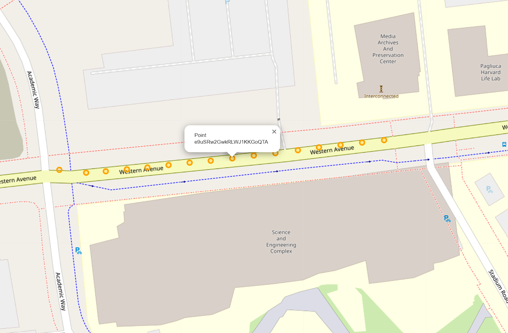
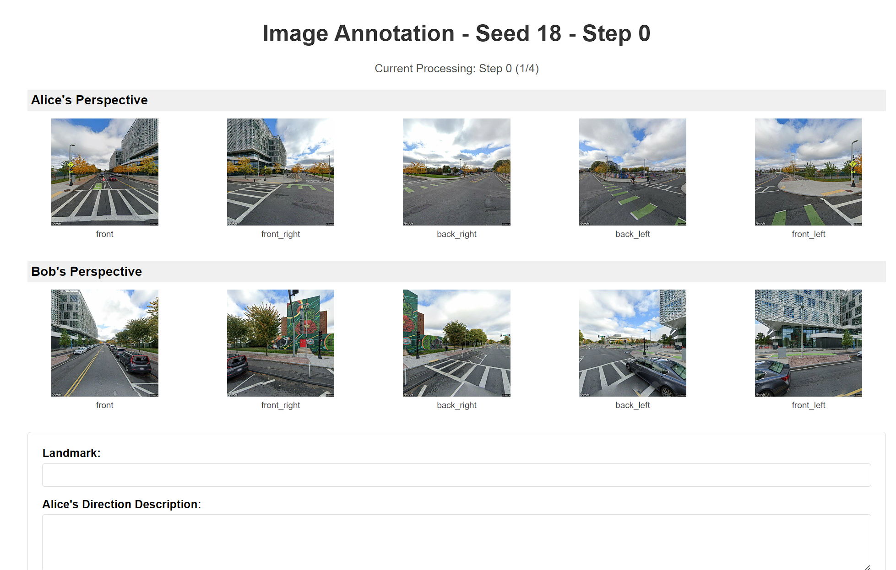
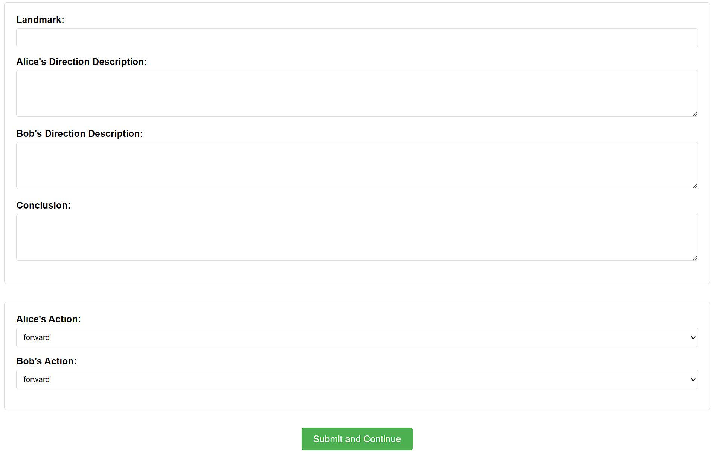

# Multi-Robot Rendezvous
## Data Collection

### Step 1: Get the key locations along the route
There are three ways to prepare Street View data:

#### Method 1: Manual Collection (Traditional)

Before data processing, you should prepare a `url.txt` under the `googledata/place{PLACE_ID}/`.

Here is an example: [url.txt](docs/resources/url.txt)

You can enter arbitrary position street view by google map like 


Then in the streetview mode, you can imagine yourself as an agent, exploring within Google Maps. Each step you move, copy the url into `url.txt` in order. 


There is a `X` symbol on the ground to label where the next step is, do not move one step too far away. And please also note that the timestamps of each panorama should be kept as consistent as possible.

#### Method 2: Automatic Route Generation (Interactive Map)

Use an interactive map interface to select start and end points:

```shell
python googledataprocess.py --api-key YOUR_API_KEY --seed PLACE_ID --mode interactive
```

This will open a browser window where you can:
1. Click on the map to set the start point
2. Click again to set the end point
3. Click the "Generate Route" button
4. Copy the generated coordinates and paste them into the terminal
5. Enter the number of sample points (default: 10)

The system will automatically generate a route and download Street View images.

#### Method 3: Automatic Route Generation (Direct Coordinates)

Provide start and end coordinates directly:

```shell
python googledataprocess.py --api-key YOUR_API_KEY --seed PLACE_ID --mode auto --start "37.7749,-122.4194" --end "37.7833,-122.4167" --samples 15
```

Parameters:
- `--start`: Starting coordinates in "latitude,longitude" format
- `--end`: Ending coordinates in "latitude,longitude" format
- `--samples`: Number of sampling points (default: 10)

### Step2: Processing the Data 

Regardless of which method you used to prepare the data, the final processing step is the same:

#### Step2.1: Parse the URL
```shell
python googledataprocess.py --api-key YOUR_API_KEY --seed PLACE_ID --function process
```

If you've already generated the `url.txt`, you can use the default `--mode manual` option.

This command will create the `pano.json` and `points.html` under the `googledata/place{PLACE_ID}/`. The `pano.json` is in the following format:
```json
{
    "nodes": {
        "ouAP9cMbZxj6zs1epXfEbA": {
            "lat": 42.3634133,
            "lng": -71.1275418
        },
        "HPrMZEbfmPETEEeX4qGrqA": {
            "lat": 42.3634014,
            "lng": -71.1273938
        },
        ...
    }
}
```
The `points.html` will display the positions of each point. When you click the dot of a location by mouse, its `pano_id` will be displayed. Like the following figure:



#### Step2.2: Download streetview by Google Map API
```shell
python googledataprocess.py --api-key YOUR_API_KEY --seed PLACE_ID --function download
```

After this, the structure of the directory will be like the following:
```
└── googledata
    ├── place0
        ├── url.txt
        ├── pano.json
        ├── points.html
        ├── id_{panoid}_{Camera_label}.jpg
    ├── place1
        ├── ...
    ├── ...
```

### Step3: Sample a Trajectory from a Place

```
python googledataprocess.py --api-key YOUR_API_KEY --seed PLACE_ID --function write --traj-id TRAJ_ID --stride STRIDE --renderzvous_point_pano_id ID
```

This command will use location in `place{PLACE_ID}` to form a trajectory in `traj{TRAJ_ID}`. The `stride` control the sample density. The `renderzvous_point_pano_id` can be None. If none, it will automatically choose the one in the middle. The results will be save in the `metainfo.json` and `route.html` under the directory `textdata/traj{TRAJ_ID}/`. 

The `metainfo.json` may look like this
```json
{
    "place": 0,
    "stride": 2,
    "renderzvous point": "cOOc3ZlgtdgALMyKuSr7gg",
    "Alice points": [
        "ouAP9cMbZxj6zs1epXfEbA",
        "98xr22ZodDaNvQOMfZSokQ",
        "pUyk49zNV0ufXKeXFizk6w",
        "vz2JanisxR6STKZC6tr8KA"
    ],
    "Bob points": [
        "QuWtKG6RBvV7HypaL7LWmg",
        "9RES6v0M_QVD4Or2bO9k9g",
        "JM7zdBEXyv-sPHC44j3Tsg",
        "e9uSRw2GwkRLWJ1KKGoQTA"
    ]
}
```

The `route.html` will be like this after rendered by browser


### Step4. Label Image with Text

```json
└── textdata
    ├── traj0
        ├── metainfo.json
        ├── route.html
        ├── answer.json
    ├── traj1
        ├── ...
    ├── ...
```

```python
python labeldata.py
```
The terminal will output a url like `http://127.0.0.1:5000` copy it and append a seed number like `http://127.0.0.1:5000/18`. It will access the images under the folder `googledata/seed18`. The website will display the images like this. 




All text you input in the website will stored in `googledata/seed18/answer_user.txt`. Click the button `Submit and Continue`, the website will refresh, and the images of the next step will display on it. 

If you want to modify something in the website, you not only need to change the `labeldata.py`, but also `templates/index.html`. Because something are defined in it and need to be consistent with `labeldata.py`. 

Then
```python
python txt2json.py --seed YOUR_DATA_SEED
```
This can convert the `googledata/seed{SEED}/answer_user.txt` to `googledata/seed{SEED}/answer.json` like the format in `docs/resources/answer_example.json`

### Step 4: Annotate Bounding Boxes

To annotate objects in Street View images with bounding boxes:

```shell
python bbox_annotator.py --data-dir googledata --seed PLACE_ID
```

The bounding box annotator provides a user-friendly interface for annotating important objects in Street View images. Here's how to use it:

1. After launching the tool, select a timestep from the dropdown menu and click "Load Images"
2. Thumbnails of all available images for that timestep will appear on the right side
3. Click on any thumbnail to load the full image for annotation
4. To add a bounding box:
    - Click and drag on the image to create a box around an object
    - Enter a description for the annotated object when prompted
5. To manage annotations:
    - Click "Preview Boxes" to see all annotations for the current image
    - Use "Highlight Selected Box" to view a specific annotation
    - Use "Clear Annotations" to remove all boxes from the current image
6. Click "Save Annotations" to store your work

Annotations are saved in JSON format at `googledata/seed{YOUR_DATA_SEED}/bbox/annotations_{SEED}.json` with normalized coordinates (0-1 range) for portability.

The tool automatically tracks which images have been annotated (marked with a green ✓), making it easy to track your progress across multiple sessions.
