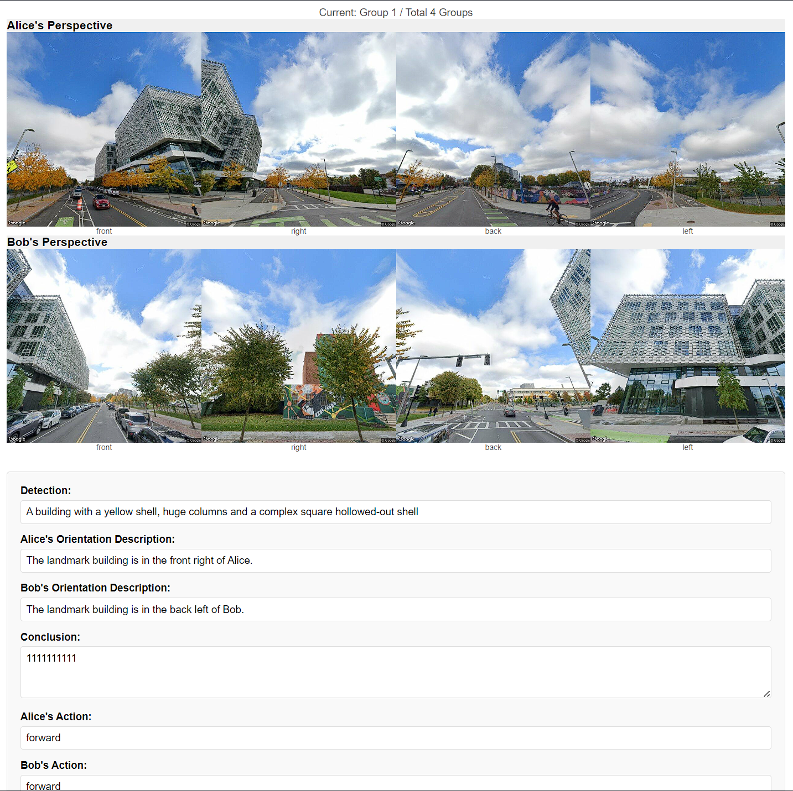

# Multi-Robot Rendezvous
## Data Collection

### Step 1: Get the key locations along the route
There are three ways to prepare Street View data:

#### Method 1: Manual Collection (Traditional)

Before data processing, you should prepare a `url.txt` under the `googledata/place{PLACE_ID}/`.

Here is an example: [url.txt](docs/resources/url.txt)

You can enter arbitrary position street view by google map like 


Then in the streetview mode, you can imagine yourself as an agent, exploring within Google Maps. Each step you move, copy the url into `url.txt` in order. 


There is a `X` symbol on the ground to label where the next step is, do not move one step too far away. And please also note that the timestamps of each panorama should be kept as consistent as possible.

#### Method 2: Automatic Route Generation (Interactive Map)

Use an interactive map interface to select start and end points:

```shell
python googledataprocess.py --api-key YOUR_API_KEY --seed PLACE_ID --mode interactive
```

This will open a browser window where you can:
1. Click on the map to set the start point
2. Click again to set the end point
3. Click the "Generate Route" button
4. Copy the generated coordinates and paste them into the terminal
5. Enter the number of sample points (default: 10)

The system will automatically generate a route and download Street View images.

#### Method 3: Automatic Route Generation (Direct Coordinates)

Provide start and end coordinates directly:

```shell
python googledataprocess.py --api-key YOUR_API_KEY --seed PLACE_ID --mode auto --start "37.7749,-122.4194" --end "37.7833,-122.4167" --samples 15
```

Parameters:
- `--start`: Starting coordinates in "latitude,longitude" format
- `--end`: Ending coordinates in "latitude,longitude" format
- `--samples`: Number of sampling points (default: 10)

### Step2: Processing the Data 

Regardless of which method you used to prepare the data, the final processing step is the same:

#### Step2.1: Parse the URL
```shell
python googledataprocess.py --api-key YOUR_API_KEY --seed PLACE_ID --function process
```

If you've already generated the `url.txt`, you can use the default `--mode manual` option.

This command will create the `pano.json` and `points.html` under the `googledata/place{PLACE_ID}/`. The `pano.json` is in the following format:
```json
{
    "nodes": {
        "ouAP9cMbZxj6zs1epXfEbA": {
            "lat": 42.3634133,
            "lng": -71.1275418
        },
        "HPrMZEbfmPETEEeX4qGrqA": {
            "lat": 42.3634014,
            "lng": -71.1273938
        },
        ...
    }
}
```
The `points.html` will display the positions of each point. When you click the dot of a location by mouse, its `pano_id` will be displayed. Like the following figure:


#### Step2.2: Download streetview by Google Map API
```shell
python googledataprocess.py --api-key YOUR_API_KEY --seed PLACE_ID --function download
```

Image will be saved as `id_{pano_id}_{front|right|back|left}.jpg` in `googledata/place{YOUR_DATA_SEED}`. 

### Step 3: Annotate Bounding Boxes

To annotate objects in Street View images with bounding boxes:

```shell
python bbox_annotator.py --seed PLACE_ID
```

The bounding box annotator provides a user-friendly interface for annotating important objects in Street View images. Here's how to use it:

1. After launching the tool, select a timestep from the dropdown menu and click "Load Images"
2. Thumbnails of all available images for that timestep will appear on the right side
3. Click on any thumbnail to load the full image for annotation
4. To add a bounding box:
    - Click and drag on the image to create a box around an object
    - Enter a description for the annotated object when prompted
5. To manage annotations:
    - Click "Preview Boxes" to see all annotations for the current image
    - Use "Highlight Selected Box" to view a specific annotation
    - Use "Clear Annotations" to remove all boxes from the current image
6. Click "Save Annotations" to store your work

Annotations are saved in JSON format at `googledata/place{YOUR_DATA_SEED}/annotations.json` with normalized coordinates (0-1 range) for portability. The json file look like this:
```json
{
  "zLqVt8pA8zM-5vC1WWIW8w_left": [
    {
      "x1": 0.2921875,
      "y1": 0.4015625,
      "x2": 0.83125,
      "y2": 0.94375,
      "description": "22222222"
    }
  ],
  "7qDwoMXYQoG2h9mo7120ww_right": [
    {
      "x1": 0.0171875,
      "y1": 0.178125,
      "x2": 0.7859375,
      "y2": 0.8703125,
      "description": "33333"
    },
    ···
  ]
}
```

The tool automatically tracks which images have been annotated (marked with a green ✓), making it easy to track your progress across multiple sessions.

After this, the structure of the directory will be like the following:
```
└── googledata
    ├── place0
        ├── url.txt
        ├── pano.json
        ├── points.html
        ├── id_{panoid}_{camera_label}.jpg
        ├── annotations.json
    ├── place1
        ├── ...
    ├── ...
```

### Step4: Sample a Trajectory from a Place

```
python googledataprocess.py --api-key YOUR_API_KEY --seed PLACE_ID --function write --traj-id TRAJ_ID --stride STRIDE --pano-id ID
python googledataprocess.py --api-key YOUR_API_KEY --seed 0 --function write --traj-id 0 --stride 2
```

This command will use location in `place{PLACE_ID}` to form a trajectory in `traj{TRAJ_ID}`. The `stride` control the sample density. The `pano-id` means rendezvous_point_pano_id. It can be None. If none, it will automatically choose the one in the middle. The results will be save in the `metainfo.json` and `route.html` under the directory `textdata/traj{TRAJ_ID}/`. 

The `metainfo.json` may look like this
```json
{
    "place": 0,
    "stride": 2,
    "rendezvous point": "cOOc3ZlgtdgALMyKuSr7gg",
    "Alice points": [
        "ouAP9cMbZxj6zs1epXfEbA",
        "98xr22ZodDaNvQOMfZSokQ",
        "pUyk49zNV0ufXKeXFizk6w",
        "vz2JanisxR6STKZC6tr8KA"
    ],
    "Bob points": [
        "QuWtKG6RBvV7HypaL7LWmg",
        "9RES6v0M_QVD4Or2bO9k9g",
        "JM7zdBEXyv-sPHC44j3Tsg",
        "e9uSRw2GwkRLWJ1KKGoQTA"
    ]
}
```

The `route.html` will be like this after rendered by browser


### Step5. Label Image with Text (Manual)

```python
python googledataannotator.py --mode web
```
The terminal will output a url like `http://127.0.0.1:5000` copy it and append a seed number like `http://127.0.0.1:5000/0`. It will access the images under the folder `textdata/traj0/metainfo.json`. Acoording to the placeid and panoid inside to load images under `googledata/place{PLACE_ID}`. The website will display the images like this. 


All text you input in the website will stored in `textdata/traj0/answer_user.txt`. Click the button `Submit and Continue`, the website will refresh, and the images of the next step will display on it. 

If you want to modify something in the website, you not only need to change the `googledataannotator.py`, but also `templates/index.html`. Because something are defined in it and need to be consistent with `googledataannotator.py`. 

Then, enter the url `http://127.0.0.1:5000/0/convert` in your browser. This can convert the `textdata/traj0/answer_user.txt` to `textdata/traj0/answer.json` like the format in `docs/resources/answer_example.json`.

If you want to check the answer, `http://127.0.0.1:5000/0/view` in your browser. The website will display the images and answers like the following:



The final directory will like this: 
```json
└── textdata
    ├── traj0
        ├── metainfo.json
        ├── route.html
        ├── answer_user.txt
        ├── answer.json
    ├── traj1
        ├── ...
    ├── ...
```

### Step6: Automated Data Processing Workflow

For more efficient data processing, you can use the automated workflow tools to handle multiple steps at once.

#### Autonomous Processing

The `autonomous_processing.py` script enables batch processing of Google Street View data and automatic trajectory creation:

```shell
python autonomous_processing.py --api-key YOUR_API_KEY --process-url --download --create-trajectory
```

Key features:
- **Process multiple place folders**: automatically handles all places with images or specified places
- **Create trajectories in batch**: generates multiple trajectories with configurable parameters
- **Flexible configuration**: specify stride, starting trajectory ID, and rendezvous points

Available options:
- `--process-url`: Process URL files to create pano.json
- `--download`: Download street view images for all specified places
- `--create-trajectory`: Create trajectories from the downloaded data
- `--place-ids`: Comma-separated list of place IDs to process (e.g., "0,1,3")
- `--traj-id`: Starting trajectory ID for creation (defaults to highest existing + 1)
- `--stride`: Stride for trajectory creation (default: 2)
- `--pano-id`: Optional rendezvous panorama ID

Example for processing specific places:
```shell
python autonomous_processing.py --api-key YOUR_API_KEY --process-url --download --create-trajectory --place-ids "0,1,2"
```

#### Human Annotation Helper

The `human_annotator_helper.py` script simplifies the annotation process for multiple trajectories:

```shell
python human_annotator_helper.py --all-trajs
```

This tool:
1. Automatically launches the annotation server
2. Opens the browser for each trajectory in sequence
3. Monitors annotation progress
4. Converts answer_user.txt to answer.json
5. Guides you through the entire annotation process

Trajectory selection options:
- `--traj-id 5`: Annotate a single trajectory (#5)
- `--traj-range "0-5"`: Annotate trajectories 0 through 5
- `--traj-list "0,3,5"`: Annotate specific trajectories
- `--all-trajs`: Annotate all existing trajectories
- `--unannotated`: Annotate only trajectories without answer.json

Additional options:
- `--wait-time 300`: Maximum time to wait for annotations per trajectory (in seconds)
- `--skip-existing`: Skip trajectories that already have answer.json files

Example for annotating only unannotated trajectories:
```shell
python human_annotator_helper.py --unannotated --wait-time 600
```

The tool will prompt you between trajectories, making it easy to take breaks during the annotation process.

## VLM Evaluation

The VLM (Vision Language Model) evaluation tool allows you to assess the performance of vision-language models on multi-agent navigation tasks. This tool evaluates a model's ability to recommend appropriate actions for two agents (Alice and Bob) based on their street view perspectives.

### Basic Usage

1. **Evaluate a single image pair**:
   ```bash
   python vlm_eval.py --traj 0 --pair_id 0
   ```
   This evaluates the first pair of images in trajectory 0.

2. **Evaluate all pairs in a trajectory**:
   ```bash
   python vlm_eval.py --traj 0
   ```
   This evaluates all image pairs in trajectory 0.

3. **Evaluate all trajectories**:
   ```bash
   python vlm_eval.py
   ```
   This evaluates all trajectories with answer.json files.

### Common Parameters

- `--model`: Specify the OpenAI model to use (default: "gpt-4o-mini")
- `--textdata_folder`: Specify the text data folder (default: "textdata")
- `--googledata_folder`: Specify the image folder (default: "googledata")
- `--output_dir`: Specify the output folder (default: "eval_results")
- `--include_thought`: Include reasoning process in the prompt
- `--use_augmentation`: Use data augmentation during evaluation
- `--visualize`: Generate visualization images of evaluation results
- `--request_delay`: Delay between API requests in seconds (default: 5.0)
- `--use_batch`: Enable batch processing for faster evaluation
- `--batch_size`: Number of requests to batch together (default: 10)

### Resuming Evaluation and Result Accumulation

The tool automatically resumes evaluation and accumulates results across multiple runs:

1. It checks for existing evaluation results in the output directory
2. It skips trajectories that have already been fully evaluated
3. For partially evaluated trajectories, it only evaluates the remaining pairs
4. The overall metrics correctly combine both previous and new results

To disable the resume functionality, use the `--no_resume` flag:
```bash
python vlm_eval.py --no_resume
```

### Handling Missing Files

The tool gracefully handles trajectories without answer.json files:

1. When scanning for trajectories to evaluate, it automatically identifies and skips folders without answer.json files
2. Warning messages are displayed for skipped trajectories
3. The evaluation continues with the valid trajectories without interruption

### Evaluation Logs

A detailed log of evaluation sessions is maintained in `eval_results/evaluation_log.txt`, which records:

- Timestamp of each evaluation session
- Model used for evaluation
- Parameters (augmentation, include_thought, etc.)
- Number of trajectories processed
- Cumulative accuracy metrics

### Output Format

After evaluation, the tool generates:

1. **Trajectory-specific results**: `eval_results/traj{n}/trajectory_results.json` with detailed information for each image pair
2. **Overall results**: `eval_results/overall_results.json` with aggregated metrics across all trajectories
3. **Visualizations** (if `--visualize` is enabled): `eval_results/traj{n}/visualizations/eval_{pair_id}.png` showing images, predictions, and ground truth

Example overall_results.json:
```json
{
  "overall_metrics": {
    "correct": 235,
    "total": 350,
    "accuracy": 0.6714
  },
  "trajectory_metrics": {
    "traj0": {
      "correct": 3,
      "total": 4,
      "accuracy": 0.75
    },
    "traj1": {
      "correct": 4,
      "total": 5,
      "accuracy": 0.8
    }
    // ... other trajectories
  }
}
```

### Advanced Usage

For large-scale evaluations or batch processing, you can set up a sequence of evaluation runs with different parameters:

```bash
# First evaluate with model A
python vlm_eval.py --model "gpt-4o-mini" --output_dir "eval_results_model_A"

# Then evaluate with model B (different output directory)
python vlm_eval.py --model "gpt-4-vision-preview" --output_dir "eval_results_model_B"

# Evaluate with data augmentation
python vlm_eval.py --use_augmentation --output_dir "eval_results_augmented"
```

You can also set a longer delay between API requests to avoid rate limits:
```bash
python vlm_eval.py --request_delay 10.0
```

For faster processing of large datasets, use batch processing:
```bash
python vlm_eval.py --use_batch --batch_size 20
```

This sends multiple requests concurrently, significantly reducing total evaluation time. Adjust the batch size based on your API rate limits and available memory.

Note: Results from different output directories will not be automatically combined.