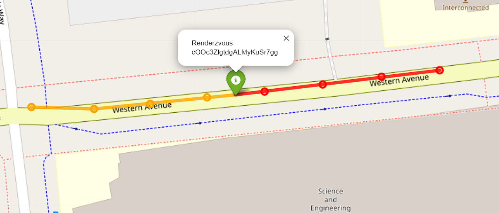
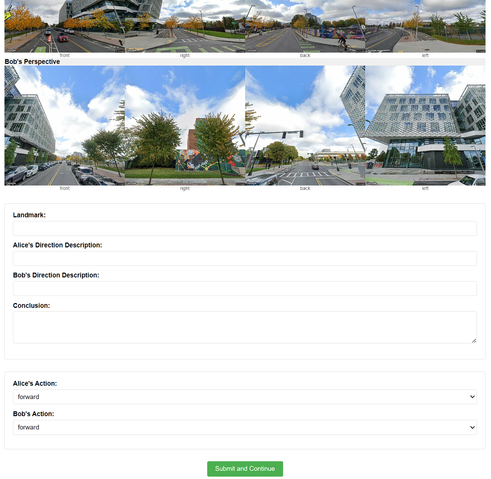

# Multi-Robot Rendezvous
## Data Collection

### Step 1: Get the key locations along the route
There are three ways to prepare Street View data:

#### Method 1: Manual Collection (Traditional)

Before data processing, you should prepare a `url.txt` under the `googledata/seed{YOUR_DATA_SEED}/`.

Here is an example: [url.txt](docs/resources/url.txt)

You can enter arbitrary position street view by google map like 

Then in the streetview mode, you can go through a route like an agent. Each step you move, copy the url into `url.txt` in order. 


There is a `X` symbol on the ground to label where the next step is, do not move one step too far away.

#### Method 2: Automatic Route Generation (Interactive Map)

Use an interactive map interface to select start and end points:

```shell
python googledataprocess.py --api-key YOUR_API_KEY --seed YOUR_DATA_SEED --mode interactive
```

This will open a browser window where you can:
1. Click on the map to set the start point
2. Click again to set the end point
3. Click the "Generate Route" button
4. Copy the generated coordinates and paste them into the terminal
5. Enter the number of sample points (default: 10)

The system will automatically generate a route and download Street View images.

#### Method 3: Automatic Route Generation (Direct Coordinates)

Provide start and end coordinates directly:

```shell
python googledataprocess.py --api-key YOUR_API_KEY --seed YOUR_DATA_SEED --mode auto --start "37.7749,-122.4194" --end "37.7833,-122.4167" --samples 15
```

Parameters:
- `--start`: Starting coordinates in "latitude,longitude" format
- `--end`: Ending coordinates in "latitude,longitude" format
- `--samples`: Number of sampling points (default: 10)

### Step2: Processing the Data 

Regardless of which method you used to prepare the data, the final processing step is the same:

```shell
python googledataprocess.py --api-key YOUR_API_KEY --seed YOUR_DATA_SEED
```

If you've already generated the `url.txt` through Method 2 or 3, you can use the default `--mode manual` option.

This command will create a `route.html`, `route_only_end.html` and some streetview images under the `googledata/seed{YOUR_DATA_SEED}/`.

```
└── googledata
    ├── seed0
        ├── url.txt
        ├── pano.json
        ├── route.html
        ├── route_only_end.html
        ├── streetview_{Agent}_{Time_index}_{Camera_label}.jpg
    ├── seed1
    ├── ...
```

The `route.html` will be like this after rendered by browser


The `route_only_end.html` will be like this after rendered by browser


### Step3: Label Image with Text
```python
python labeldata.py
```
The terminal will output a url like `http://127.0.0.1:5000` copy it and append a seed number like `http://127.0.0.1:5000/18`. It will access the images under the folder `googledata/seed18`. The website will display the images like this. 




All text you input in the website will stored in `googledata/seed18/answer_user.txt`. Click the button `Submit and Continue`, the website will refresh, and the images of the next step will display on it. 

If you want to modify something in the website, you not only need to change the `labeldata.py`, but also `templates/index.html`. Because something are defined in it and need to be consistent with `labeldata.py`. 

Then
```python
python txt2json.py --seed YOUR_DATA_SEED
```
This can convert the `googledata/seed{SEED}/answer_user.txt` to `googledata/seed{SEED}/answer.json` like the format in `docs/resources/answer_example.json`